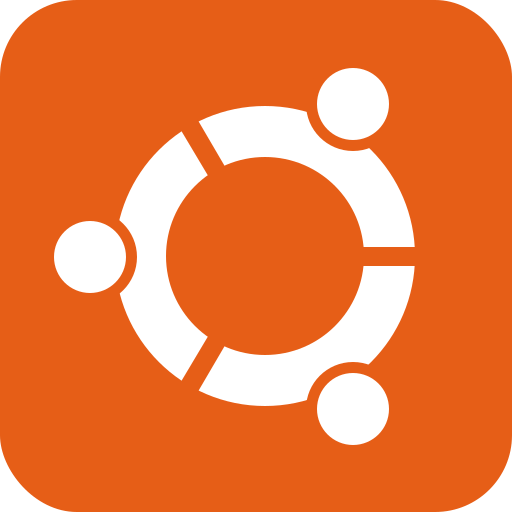

# Hi there, welcome to my profile.

## Here are some facts about me.

- My journey with programming started in 1991 when JavaScript wasn't even created yet and my journey with Linux began in 1998 when it started to be taken seriously on the server-side.
- My hobby is making music, messing around with different audio technologies, being a wanna be audiophile and home labbing till it hurts.
- Fun fact: I love open source software.

### Connect with me

[][linkedin]
[][twitter]

 
 

### Programming & Scripting:

 
 

### Server Operating Systems

 
 

### Virtualization & Containerization

 
 

### IaC & CI/CD

[linkedin]: https://www.linkedin.com/in/wael-ramadan-07492622/
[twitter]: https://twitter.com/WMRamadan
